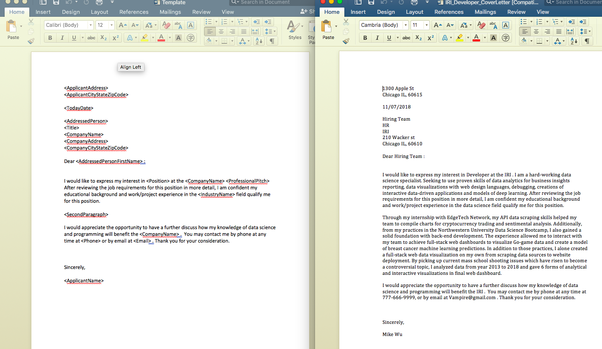

# Cover Letter Batch Creator

Anyone is annoyed that if you are job hunting , there are 7 out of 10 jobs require or optionally imply to you to have a cover letter knowing the fact that nobody will ever really read it in the initial candidate filtering process ?

And then you spent half of the application time to write your cover letter in addition to fill out those lengthy background check then you never heard anything back from the company?

This is simple program is for people who want to automate and batch creating their own customized cover letters:

## See "AutomationCoverLetterOperationExamples.ipynb" as an example to run code

Process:

* Step 1: Please refer to format Template.docx file, user may create their own cover letter template with different framework or Variable <>. Or user may just use my template(pretty universial). Template.docx is referenceing Penn State University cover letter template.

####  Warning: You may run into format or error problem if user decided to create another template from scratch. but If you decide to use my cover letter template, Please only modify the varaibles (<>). 

* Step 2: Please refer to the format of CompanyNameSheet.csv within the CompanyResearch folder, User may do research on the companies that requires cover letter in the application process. Then users may fill up the names of the company and job titles that you want to apply for in the CompanyNameSheets.csv

* Step 3: Please Refer to my 'AutomationCoverLetterOperationExamples.ipynb' and three python functions in Code folder, After done with step 1 & 2, users may run two functions functions from 'Step1CreateParamtersforNext2Func.py' & 'Step2CreateCustomzedCSV.py' to return csv file named such as 'Accenture_Analyst.csv'. Those are the excel in which you need to fill out personalzied parts for your cover letters in each company/job title (refer to format of Template.csv).

* Step 4:  Please Refer to my 'AutomationCoverLetterOperationExamples.ipynb' and three python functions in Code folder, users may run the function in 'Step3CreateCustomizedCoverLetter.py', which will output an folder containing all the cover letters for positions you want to apply for.
